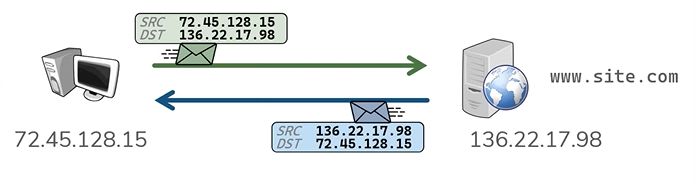
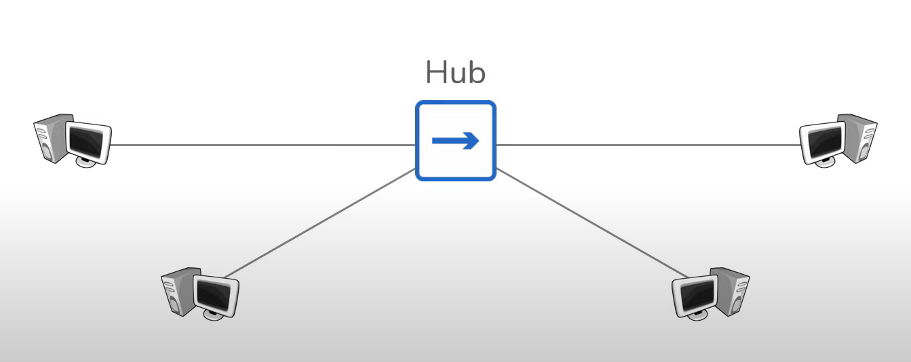
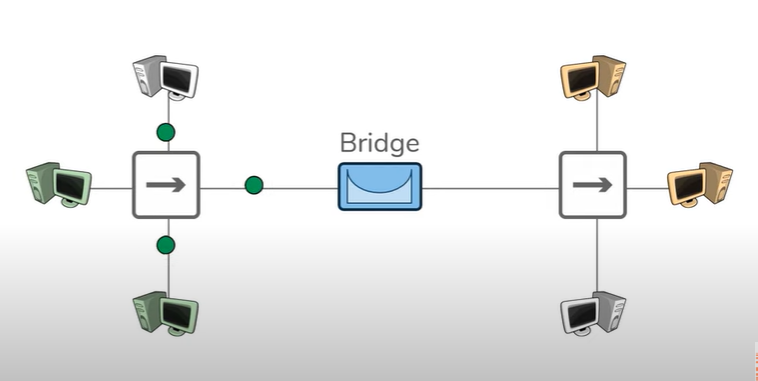
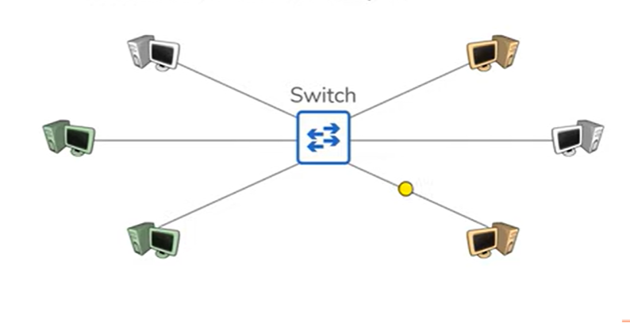
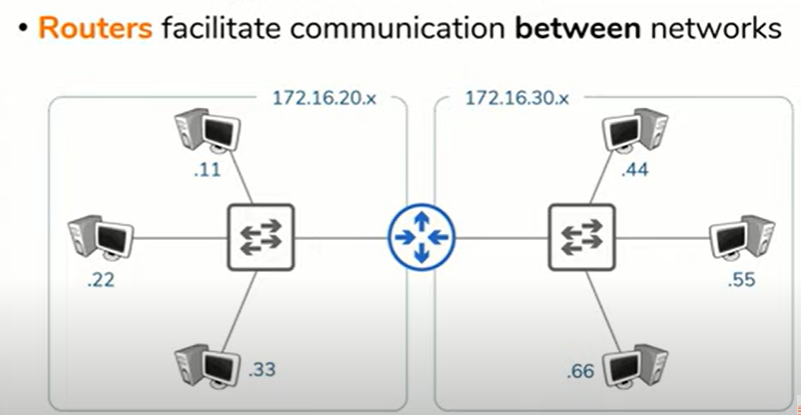
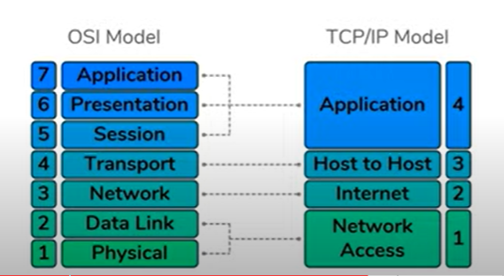
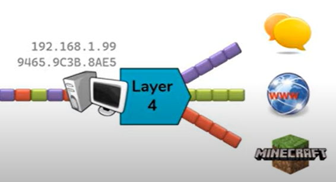
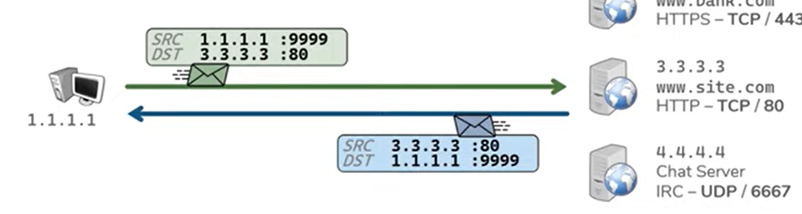
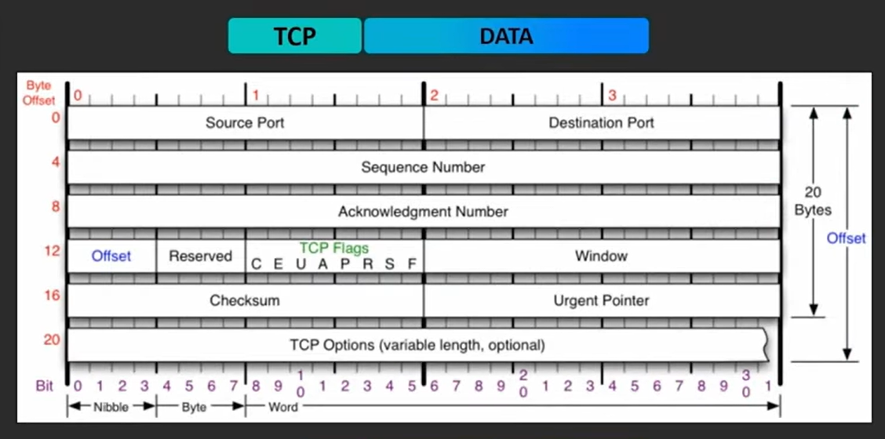
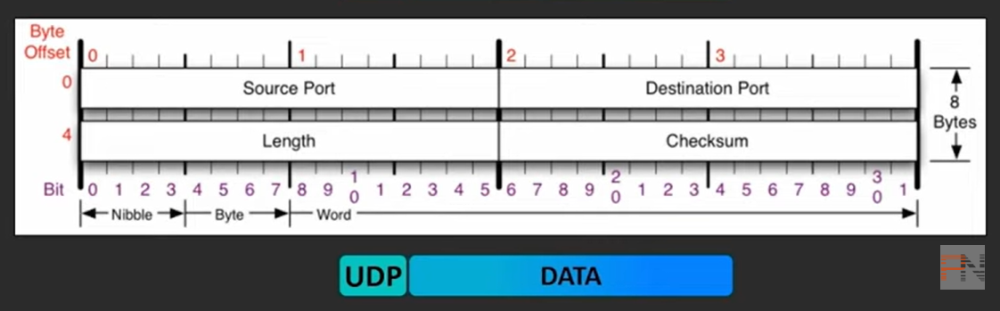

# Ağ ile İlgili Temel Bilgiler

## Network (Ağ) Cihazları

* Network (Ağ): Cihazlar arası iletişimi sağlayan bağlantılar sistemi.
* Host: Ağ'a bağlı, iletişim alan/yollayan her cihaz
* Client: Request(istek) gönderen cihaz
* Server: Request'e cevap veren cihaz  
* IP Adresi: Hostların kimliğini belirten numara.

* IP'ler 32 bittir. (IPv4) 
* _Oktet_ denilen 4 parçaya ayırıp yazarız.

Sinyal kuvveti mesafeyle azalır. Daha uzak mesafeye kayıpsız iletim için _Repeater_ kullanılır.

* Hub aldığı sinyali bağlı olduğu bütün cihazlara dağıtan bir repeater çeşididir.

* Köprüler dağıtımın bir kısımdan diğer kısma geçişini denetler. Geçişe izin verir ya da vermez.

* Switcher bağlı olan bütün cihazlara değil, yalnızca belirtilen cihazlara veri iletimini sağlar. 

### İnternet: Birbirine bağlı ağlardan oluşan büyük ağ.

## OSI (Open Systems Interconnection) Model

### Katman 1 — Fiziksel — Bitlerin İletimi

* 0'lardan ve 1'lerden oluşan verinin iletimi.
* Bu bitleri taşıyan cihazlar Katman 1'e aittir.
* Katman 1 : Kablo, Wifi, *Repeater*

### Katman 2 — Bağlantı Noktaları — Bağlantı Noktaları Arasında

* Kabloya (Fiziksel katmana) direkt bağlantılı olan cihazları kapsar.
* NIC — Network Interface Cards (Ağ arabirim denetleyicisi) / Wi-Fi Kartları / *Switchler*
* MAC adresleri ile adreslenirler
* Her NIC bir MAC adresine sahiptir.
* MAC adresleri 48 bittir, 12 basamaklı hexadesimal olarak gösterilir
* 94-65-9C-3B-8A-E5  / 9465.9C3B.8AE5 / 94:65:9C:3B:8A:E5

### Katman 3 — Ağ — Uçtan Uca

* IP adresleriyle adreslenir.
* IPv4 32 bittir. 0-255 arası 4 oktet olarak gösterilir.
* Katman 3 Cihazları: Routers, Hosts, (anything with an IP)

### Katman 4 — Transport — Servisten Servise

* Data stream'ler arası ayrımı sağlar.
* Port'lar üzerinden adreslenir
* Port: 0-65535 - TCP : _Güvenilir Veri İletimi_
* Port: 0-65535 - UDP : _Verimlilik_
* Serverlar önceden belirlenmiş Portlara gelen requestleri dinler.
* Client'lar her bağlantı için rastgele bir port seçer.

## Protokoller

Internet standartlarını belirleyen kurallar.

* ARP - Address Resolution Protocol [RFC 826]
  * IP/MAC adresi çözümlemesi için
  * ARP Requestleri
* FTP
  * File Transfer Protocol
* SMTP
  * Simple Mail Transfer Protocol
* HTTP
  * Hyper Text Transfer Protocol
* SSL
  * Secure Sockets Layer
* TLS
  * Transport Layer Security
* HTTPS
  * HTTP + SSL/TLS korumalı
* DNS
  * Domain Name System
  * Domain isimlerini IP'ye çevirir.
  * site.com $\rightarrow$ 160.8.23.154
* DHCP — Dynamic Host Configuration Protocol
  * DHCP Server cihazlara IP ataması yapar.

# TCP / UDP Karşılaştırması

## TCP : Transmission Control Protocol

* Bağlantı öncelikli
  * Başlangıç ve bitiş belirlidir.
* Güvenilirdir
  * Veri iletimi doğrulanır.
  * Gönderici oluşan hatalar hakkında bilgi sahibidir.
* Data sırasıyla gönderilir.
* İletim akış kontrollü.
  * TCP maksimum bant genişliğini aşmamak adına kontrollü veri gönderir. Hızını ayarlar.
* TCP daha fazla önbilgi içerir.

## UDP : User Datagram Protocol

* Bağlantı önceliği yoktur
  * Başlangıç ve bitiş iletileri yok.
  * Zaman aşımına bağlı olarak bağlantı ayarlanır.
* Veri iletimi doğrulaması yoktur. 
  * Veri yalnızca gönderilir.
  * Katman 4'te hataya dair bir farkındalık oluşturmaz.
* Veri sıralama sistemi içermez
* Akış hızı kontrolü yoktur
  * Veriyi olabildiğince hızlı iletir.
* UDP daha az önbilgi içerir.

---

## UDP

* Length
  * Min 8 byte
  * Header ve data'nın byte cinsinden boyutu
* Checksum
  * Sağlama için kullanılır
  * IPv4'te kullanılmayabilir
  * Kullanılmadığı durumda 0'dır.

## TCP

* Sequence Number:
  * Gönderilen veriyi takip eder.
* Acknowledgement Number:
  * Elde edilen veriyi takip eder.

&nbsp; 

A $\xrightarrow{SEQ=1001\space\space[200 Byte]}$ B  
A $\xleftarrow{ACK = 1201}$ B $\implies$ B Mesaj Alındı.  
A $\xrightarrow{SEQ = 1201\space\space[100 Byte]}$ B  
A $\xleftarrow{ACK = 1301}$ B $\implies$ B Mesaj alındı.  
...  

* Sequence / Acknowledgement sayıları byte cinsindendir
  * ACK = SEQ + Bytes elde edilen byte sayısı
  * SEQ = En son ACK numarası
* TCP gönderilen her şeyi "Retransmission Timeout" süresince cache'de tutar. (Tekrar iletim için gerekli zamanaşımı)
* Eğer ACK almazsa, paketi tekrardan yollar.
* Geciktirilen Acknowledgement:
  * Her iki parça için bir ACK gönderimi.
  * Tek sayıda paket gönderildiyse belirli bir zamanaşımı sonrası ACK gönderilir.
  * Geciktirilen ACK'ler toplam elde ediler byte'a göredir.
* Window Size ne kadar unacknowledged veri gönderilebileceğini sınırlar.
* Window Size her iletimde gönderilir.
* TCP çift yönlü çalışır — cihazlar aynı anda hem geribildirim hem iletim yapabilir.
  * İki cihaz da SEQ ve ACK numarasına sahiptir
* Initial Sequence Numbers (ISN) (Başlangıç Sequence Sayısı) gönderici tarafından rastgele belirlenir.
* Bağlantı oluşturma/doğrulama sırasında belirtilir. (3-way handshake)

Three Way Handshake  

A $\xrightarrow{SEQ_{initial} = X }$ B  
A $\xleftarrow[SEQ_{initial}=Y]{ACK_{confirmed} = X+1}$ B  
A $\xrightarrow{ACK_{confirmed} = Y+1 }$ B
  
TCP bağlantı sonlandırmanın iki yöntemi vardır:  
* Graceful  
  * FIN flag  
* Ungraceful
  * RST flag

Four Way Closure / Graceful / FIN flag  

A $\xrightarrow{(FIN)\space\space\space SEQ_{last} = X }$ B  
A $\xleftarrow{ACK = X+1}$ B  
A $\xleftarrow{(FIN)\space\space SEQ_{last}=Y}$ B  
A $\xrightarrow{ACK = Y+1 }$ B

* Ungraceful bağlantı sonlandırma: Tek yönlü bir RST flag ile:
flag
* A $\leftrightarrow$ B Bir şeyler yanlış gittiğinde iki taraftan biri RST atar.
* RST için ACK yoktur ve her iki taraf da atabilir.

## UDP

* UDP bu gibi uygulamalar için idealdir:
  * Küçük request ve cevaplar kullanan uygulamalar.
    * Örn: DNS
      * UDP : 2 Paket
      * TCP : 11 Paket
      * Çoğu mesaj 300 byte'tan küçük ve tek bir pakete sığıyor
    * Diğer Örn: NTP SNMP DHCP Syslog
  * Kendi veri iletim doğrulamasını yapan uygulamalar.
    * İki adet iletim doğrulama sistemi gereksizdir.
    * Örn: TFTP (Trivial File Transfer Protocol)
    * Diğer Örn: RTP SNMP QUIC
  * Son iletilen / Gerçek zamanlı paket iletilemeyen gecikmiş paketlerden daha önemli ise
  * Canlı yayın / anlık iletime sahip uygullamalar
    * Örn: VOIP — Voice Over IP
  * Başka Protokoller: RTP SRTP SIP H.323
  * Örnekler: Canlı TV, Multiplayer Oyunlar

  ### Kaynak: [Networking Fundamentals @Practical Networking](https://www.youtube.com/playlist?list=PLIFyRwBY_4bRLmKfP1KnZA6rZbRHtxmXi)
